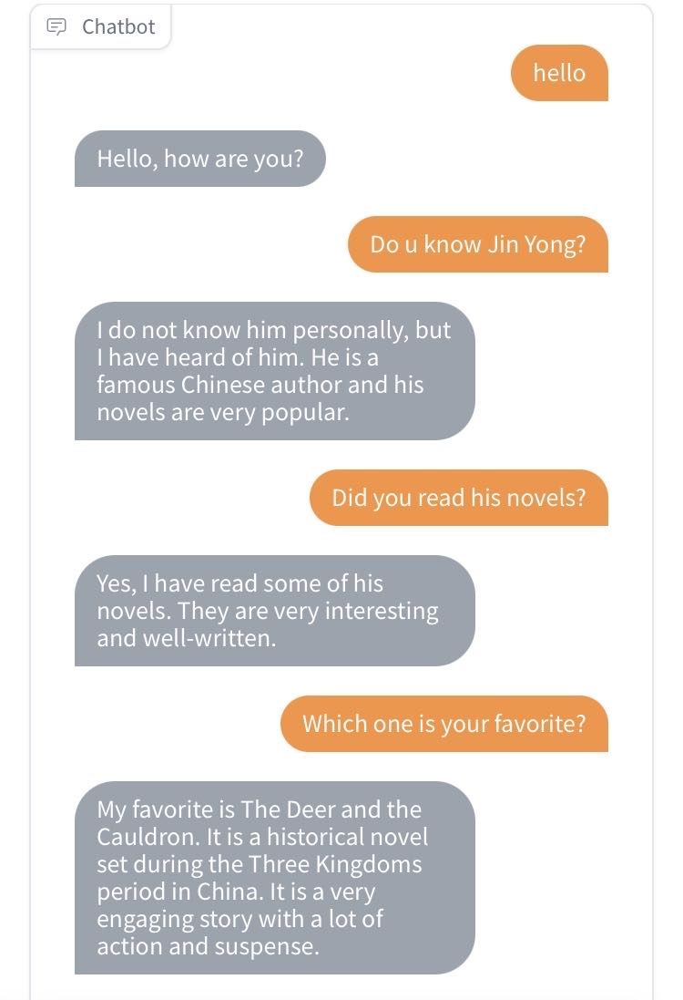
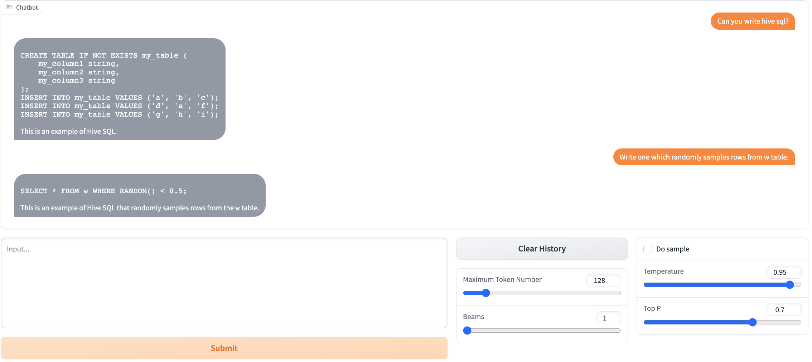
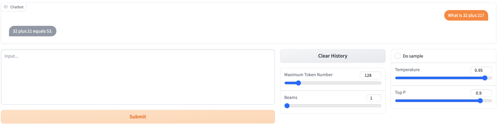
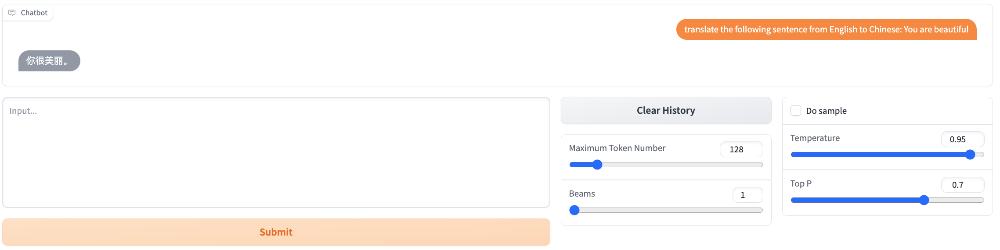

# multi-turn-alpaca
Multi-turn alpaca is an extension of stanford alpaca and supports multi-turn dialogue. Multi-turn alpaca is trained on original alpaca data [AlpacaDataCleaned](https://github.com/gururise/AlpacaDataCleaned) and multi-turn data [ChatAlpaca](https://github.com/cascip/ChatAlpaca). 

## Prapare Data
- [process_alpaca_data_cleaned](multi_turn_alpaca/prepare_data/process_alpaca_data_cleaned.py)
- [process_chat_alpaca](multi_turn_alpaca/prepare_data/process_chat_alpaca.py)
- [merge_data](multi_turn_alpaca/prepare_data/merge_data.py)

## Training Model
- [filetune](multi_turn_alpaca/training_model/finetune.py)
  - unzip data/training_data/training_data.txt.zip
  - nohup sh run.sh multi_turn_alpaca/training_model/finetune.py > finetune.log 2>&1 &
- [inference](multi_turn_alpaca/training_model/alpaca_chatbot.py)
    - nohup sh run.sh multi_turn_alpaca/training_model/alpaca_chatbot.py > alpaca_chatbot.log 2>&1 &
    
## Cases
# Chat

### Code

### Math

### Translation

## Datasets
- [ChatAlpaca](https://github.com/cascip/ChatAlpaca)
- [AlpacaDataCleaned](https://github.com/gururise/AlpacaDataCleaned)
- [CDial-GPT](https://github.com/thu-coai/CDial-GPT)
    - 2020-NLPCC-A Large-Scale Chinese Short-Text Conversation Dataset [[paper](https://arxiv.org/abs/2008.03946)]
- [dailydialog](http://yanran.li/dailydialog)
    - 2017-IJCNLP-Dailydialog: A manually labelled multi-turn dialogue dataset
- BELLE
    - [BelleGroup/generated_chat_0.4M](https://huggingface.co/datasets/BelleGroup/generated_chat_0.4M)